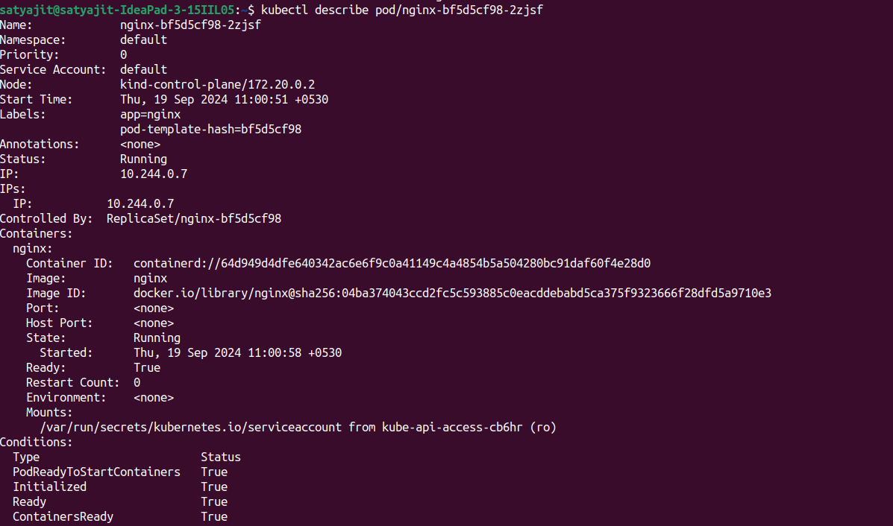
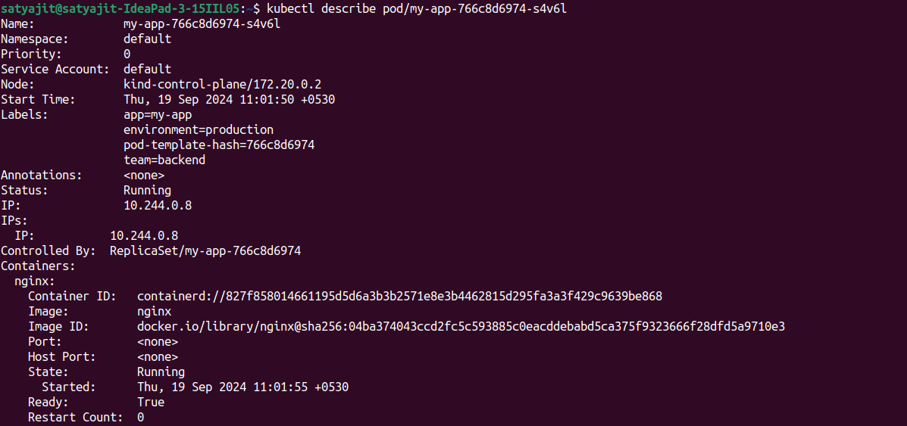

# Pod Labeler Operator

The Pod Labeler Operator is a custom-built Kubernetes Operator, developed using the Operator SDK, to automate the process of labeling pods dynamically based on user-defined criteria. By leveraging Custom Resources (CRs) and Custom Resource Definitions (CRDs), this operator provides a declarative way to assign labels to pods.

## Architecture
- Once deployed, the Pod Labeler Operator continuously watches the state of your cluster. It monitors pods in real-time, evaluating them against the selectors specified in the CR. 
- Whenever a pod that matches the defined selector is detected, the operator automatically applies the appropriate labels, ensuring your pod labeling remains accurate and up-to-date without manual intervention.
- Reconciler Loop is called every 15 secs so if any drift is caught that is not in accordance with the CR then the reconcillation logic will reconcile it 

## Prerequisites
- Kubernetes 1.16+
- kubectl CLI installed and configured for your cluster
- Operator SDK (if you want to build or extend the operator)

## Getting Started

1.Clone the Repository

```
git clone https://github.com/satyazzz123/pod-Labeler-Operator.git
```
2.Install the CRD

```
kubectl apply -f config/crd/bases

```
3. Test Locally
```
make run
```
4. Deploy the sample CR
```
kubectl apply -f config/samples/api_v1alpha1_podlabeler.yaml
```
Here the Sample Cr is this
```
apiVersion: api.satyazzz123.online/v1alpha1
kind: PodLabeler
metadata:
  name: example-podlabeler
  namespace: default
spec:
  selector:
    app: my-app
  labels:
    environment: production
    team: backend

```
5.Deploy a Pod with label app=nginx(label Operator won't attach the labels mentioned in your CR)
```
kubectl create deployment nginx --image nginx
```
6.Deploy a Pod with label app=my-app(label Operator will attach the labels mentioned in your CR)
```
kubectl create deployment my-app --image nginx
```
## Results
#### Pod with not the same selector as the Cr

#### Pod with same selector as the Cr



